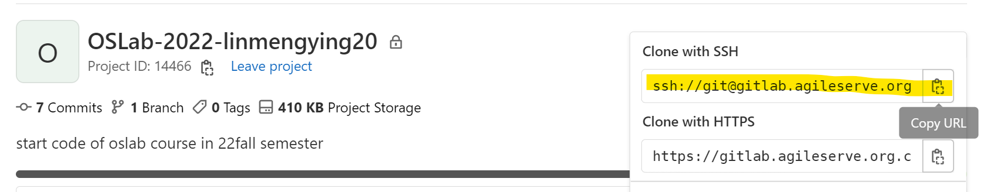

# PRJ 1

## 写在前面
本代码S-core的实现：
将执行顺序写在seq.txt文件内，或在createimage.c中指定别的文件：
- 每个task以‘#’分割
- 支持任务有效性检查，若在seq.txt中要求载入未定义的任务会输出提醒

> 若需正常加载图片，请将本文件和对应的.pic文件置于同一个文件夹下
> 本文档仅记录写代码过程，中间的代码未必与最终版代码一致

## 环境配置

### 配置免密登录

1. 设置邮箱：

```
git config --global lingmengying20@mails.ucas.ac.cn
```

2. 生成密钥：

```
cd && ssh-keygen –t rsa –C "lingmengying20@mails.ucas.ac.cn"
```

别忘了双引号！之后无脑回车就行。

终端输入：

```
vim ~/.ssh/id_rsa.pub
```

把内容全部复制。

3. 云端配置ssh

登录gitlab，打开右上角Edit Profile


点击左侧ssh keys


在`Key`那一栏粘贴复制的内容，`Title`设置为一个记得住的名字（这里我用了ucas-os）。


点击左侧Access token，Token name设置为刚刚写的`Title`。

勾选api后点击create personal token。


此后按图中红框键复制token


终端输入：

```
cd && vim .gitlab.token
```

将token粘贴保存后退出。


此后clone的时候对应地改成使用ssh模式：



设置remote的时候相应地使用ssh：

```bash
git remote set-url origin ssh://git@gitlab.agileserve.org.cn:8082/ucas-oslab-2022/linmengying20.git


git remote set-url upstream ssh://git@gitlab.agileserve.org.cn:8082/xuyibin21b/ucas-os-22fall.git
```

### 后续免密登录遇到的问题


尝试重新生成密钥、按照上述流程重新配置均无果。

使用如下代码debug，查看问题：

```
 ssh -v git@gitlab.agileserve.org.cn -p 8082
```


显示能够与之通信但是被拒绝连接，可能是serve平台的问题。

## TASK 1

Task 1难度不大，具体分为如下几个步骤：

- 阅读讲义可知每次调用只需`call bios_func_entry`；

- 查看`common.c`的实现并结合讲义讲解可知，每次调用`bios_func_entry`，其都会跳转到`0x50150000`，并根据给出的首个参数`which`来判断具体实现哪个功能：

  ```assembly
  static long call_bios(long which, long arg0, long arg1, long arg2, long arg3, long arg4)
  {
      long (*bios_func)(long,long,long,long,long,long) = \
          (long (*)(long,long,long,long,long,long))BIOS_FUNC_ENTRY;
  
      return bios_func(which, arg0, arg1, arg2, arg3, arg4);
  }
  ```

- 查看`bios_def.h`获取各个功能对应的"which"

  ```c
  #define BIOS_PUTCHAR 1
  #define BIOS_GETCHAR 2
  #define BIOS_PUTSTR 9
  #define BIOS_SDREAD 11
  ```

- 再次查看`common.c`获取 各个函数的所需参数，最终实现如下：

    ```assembly
    // TODO: [p1-task1] call BIOS to print string "It's bootblock!"
        li a0, 9		// number for func bios_putstr
        la a1, msg		// addr of string
        call bios_func_entry
    ```

运行结果如下：


## TASK 2

### 1. 从SD卡内拷贝kernel

此次任务首先需要将内核代码从SD卡中读入内存，需要使用`bios_sdread`的API：

- 同task 1，获知所需参数以及该功能对应的`BIOS_SDREAD`；
- 阅读讲义获取内核拷贝位置`0x50201000`（即定义的`kernel`）；
- 从给定的位置（`os_size_loc`）读入内核大小；
- 跳转到`bios_func_entry`

代码实现如下：

```assembly
	// TODO: [p1-task2] call BIOS to read kernel in SD card
	li a0, 11		// number for func bios_sdread
	la a1, kernel	// load kernel to given address
	
	la x5, os_size_loc
	lh a2, (x5)		// load in block_nums

	li a3, 1		// start from 2nd block , index is 1
	call bios_func_entry

```

### 2. 清空bss段

查看riscv.lds文件得知，bss段起始分别由`__bss_start`和`__BSS_END__`给出：


则只需在循环内不断将0号寄存器的值存入内存即可：

```assembly
  /* TODO: [p1-task2] clear BSS for flat non-ELF images */
  la x5, __bss_start         // bss起始地址
  la x6, __BSS_END__         // bss终止地址
do_clear:  
  sw  x0, (x5)          // store 0 to x5
  add x5, x5, 0x04      // point to next word
  ble x5, x6, do_clear
```

同时需要将栈指针设到指定位置：

```assembly
  /* TODO: [p1-task2] setup C environment */
  la sp, KERNEL_STACK   // set stack pointer to the given addr
  call main
```

### 3. 跳转到kernel代码入口

此后再跳转到kernel执行，但首次`j kernel`跳转到kernel执行出错，console输出发生例外，指令无效：

```
exception code: 2 , Illegal instruction , epc 50201000 , ra 50200016
```

> epc :exception program counter , 异常程序计数器, ra : return address 返回地址

仔细阅读讲义，发现我居然在看TASK 3的实验步骤，并使用了`make all`，用没开始编写的createimage.c制作内核🤡。

按照TASK 2的步骤可正常运行并输出。

结果如下：


### 4. 实现回显

#### （1）riscv-gnu-gcc对char的处理

起初代码实现如下：

```c
    //读取终端输入并回显
    char tmp;
    while(1){
        while((tmp=bios_getchar())==-1);
        bios_putchar(tmp);
    }
    
```

输出结果：


查看main.txt里的反汇编代码：

```assembly
    502012aa:	ddbff0ef          	jal	ra,50201084 <bios_putstr>
    502012ae:	0001                	nop
    #以下是回显的代码
    502012b0:	e23ff0ef          	jal	ra,502010d2 <bios_getchar>
    502012b4:	87aa                	mv	a5,a0
    502012b6:	fef401a3          	sb	a5,-29(s0)
    502012ba:	fe344783          	lbu	a5,-29(s0)
    502012be:	2781                	sext.w	a5,a5
    502012c0:	853e                	mv	a0,a5
    502012c2:	de9ff0ef          	jal	ra,502010aa <bios_putchar>
    502012c6:	b7e5                	j	502012ae <main+0x10c>
```

不知道为啥没有判断结果是否为-1就直接putchar了。补充一下`sext.w`指令：


查看common.h：

```c
// get a char from serial port
// use bios getch function
int port_read_ch(void);
```

读入的是int类型，而我定义的tmp是char类型的。照理来说char→int是符号扩展，-1的十六进制0xFFFFFFFF，即使截断后再扩展为int理应还是等于-1，不会判断出错，猜测riscv gcc编译器把它当成了unsigned int？

做个小测试：

```c
    //读取终端输入并回显
    char tmp;
    while(1){
        while((tmp=bios_getchar())==255);
        bios_putchar(tmp);
    }
    
```

此时可正常回显输出：


搜索资料得知也有人发现riscv-gnu-gcc对于char类型的配置是默认其unsigned

[signed char gcc bug · Issue #89 · riscv-collab/riscv-gnu-toolchain (github.com)](https://github.com/riscv-collab/riscv-gnu-toolchain/issues/89)

> Our GCC port looks internally consistent to me:
>
> ```bash
> $ riscv64-unknown-linux-gnu-gcc -dM -E -c /usr/riscv64-unknown-linux-gnu/usr/include/limits.h | grep CHAR_MIN
> #define SCHAR_MIN (-SCHAR_MAX - 1)
> #define __WCHAR_MIN__ (-__WCHAR_MAX__ - 1)
> #define CHAR_MIN 0
> $ cat -n riscv-gnu-toolchain/gcc/gcc/config/riscv/riscv.h  | grep DEFAULT_SIGNED_CHAR
>    859  #define DEFAULT_SIGNED_CHAR 0
> ```
>
> Unless I've missed something and it's explicitly stated somewhere that "char" is signed on RISC-V, I think this isn't actually a bug.

从上述帖子可知即使`riscv-gnu-gcc`默认char是无符号数（DEFAULT_SIGNED_CHAR 0），其定义的char的最小值为0。

#### （2）最终代码

直观&保险起见还是将char改为int，不断从终端读入，直到读入的字符不等于-1，退出内层循环并输出：

```c
    //读取终端输入并回显
    int tmp;
    while(1){
        while((tmp=bios_getchar())==-1);
        bios_putchar(tmp);
    }
```

## TASK 3

### 1. createimage.c文件理解

#### 结构体

`options`：存储命令行参数

```
static struct {
    int vm;
    int extended;
} options;
```

#### 函数

```c
/**
* @brief 利用ELF文件构建镜像
* @param nfiles：文件个数（由命令行参数个数-1得）
* @param files：文件
**/
static void create_image(int nfiles, char *files[]);


/**
* @brief 从文件fp内读取其ELF文件头并存于ehdr
**/
static void read_ehdr(Elf64_Ehdr *ehdr, FILE *fp);

/**
* @brief 从文件内读取程序头表并存于phdr
**/
static void read_phdr(Elf64_Phdr *phdr, FILE *fp, int ph, Elf64_Ehdr ehdr);

/**
* @brief 从ehdr（类型：ELF文件头结构体）内读取入口
**/
static uint64_t get_entrypoint(Elf64_Ehdr ehdr);

/**
* @brief 从phdr（类型：程序头结构体）内读取当前segment在ELF文件内的大小
**/
static uint32_t get_filesz(Elf64_Phdr phdr);

/**
* @brief 从phdr（类型：程序头结构体）内读取当前segment在内存中大小（有填充or不填充两种case）
**/
static uint32_t get_memsz(Elf64_Phdr phdr);

/**
* @brief 将程序头phdr和ELF文件写入镜像文件img内，其中phyaddr指示该从哪开始写
**/
static void write_segment(Elf64_Phdr phdr, FILE *fp, FILE *img, int *phyaddr);

/**
* @brief phyaddr指向当镜像文件img结尾处，将之padding到new_phyaddr
**/
static void write_padding(FILE *img, int *phyaddr, int new_phyaddr);

/**
* @brief 将kernel所占扇区数写入image文件的特定位置
* @param nbytes_kernel kernel所占扇区总bytes数
* @param taskinfo 
* @param tasknum
**/
static void write_img_info(int nbytes_kernel, task_info_t *taskinfo,
                           short tasknum, FILE *img);
```

### 2. 将内核大小写入指定位置

记得task 2内说明我们可以在`os_size_loc, 0x502001fc`处读得kernel大小，这个就是`nbytes_kernel`该写在的位置，task 3内我们只需要写好该变量的位置，其余是task 4的任务。

对于文件读写不太熟悉，查找资料：

> ```
> int fseek( FILE *stream, long offset, int origin )
> ```
>
> 可以使用该函数定位文件指针，文件指针的位置决定你读写文件的起始位置。
>
> - 参数origin ：表示从哪里开始偏移，值有：
>   - SEEK_SET： 文件开头
>   - SEEK_CUR： 当前位置
>   - SEEK_END： 文件结尾
> - 参数offset：表示偏移的字节数，正数表示正向偏移，负数表示负向偏移
>
> [(20条消息) C语言文件io操作，从文件中间写入-编程语言-CSDN问答](https://ask.csdn.net/questions/7440531)
>
> 
>
> ```
> size_t fwrite(const void *ptr, size_t size, size_t nmemb, FILE *stream)
> ```
>
> - **ptr** -- 这是指向要被写入的元素数组的指针。
> - **size** -- 这是要被写入的每个元素的大小，以**字节为单位**。
> - **nmemb** -- 这是元素的个数，每个元素的大小为 size 字节。
> - **stream** -- 这是指向 FILE 对象的指针，该 FILE 对象指定了一个输出流。

故只需使用`fseek`将文件指针定位到`OS_SIZE_LOC`，并使用`fwrite`写入两个字节的内核大小。注意需考虑内核大小不能整除512的情况，需多加一个sector：

```c
int nsec_kern = (nbytes_kern / SECTOR_SIZE) + (nbytes_kern % SECTOR_SIZE != 0);
    fseek(img, OS_SIZE_LOC, SEEK_SET);  // set fileptr to OS_SIZE_LOC
    fwrite(&nsec_kern, 2, 1, img);      // write 2 bytes into img, 写文件时文件指针也会移动
    printf("Kernel size: %d sectors\n", nsec_kern);
```

后续发现源代码中已经很友善地封装了一个宏，可直接把byte转sector：

```c
#define NBYTES2SEC(nbytes) (((nbytes) / SECTOR_SIZE) + ((nbytes) % SECTOR_SIZE != 0))
int nsec_kern = NBYTES2SEC(nbytes_kern);
```


### 3. 读入taskid并加载用户程序

#### （1）createimage时的padding操作

如讲义中所言，此task中可将所有用户程序pad到和kernel一样的大小（这里我按照讲义中的建议，统一填充至15个扇区）。

#### （2）loader配套读操作

由于上述padding中每一个文件大小都被补到了15个扇区，读出时就需要根据taskid计算出每个用户程序的起始位置，伪代码如下：

```
用户程序i的起始sector = bootloader所占sector(s) + 15 * i 
```

#### （3）debug过程

首版createimage代码如下：

```c
int cur = 0;
if (strcmp(*files, "bootblock") == 0) {
            // [p1-task3]
            cur += SECTOR_SIZE;
            write_padding(img, &phyaddr, SECTOR_SIZE);
        }
        else{
            // [p1-task3]
            cur += SECTOR_SIZE*15;
            write_padding(img, &phyaddr, cur);
        }
}
```

运行时出现核心转储：


gdb跟踪发现一旦跳转到用户程序入口地址就会报错。在同学提醒下查看`make all`的输出：


发现用户程序没有被padding……

反观`createimage`，我居然把当前应padding到的位置的清零放在了处理文件的循环内部🤡（图中所示代码外层包着处理文件的循环）！！


改正后make all输出如下（讲义诚不欺我！都填到15个sectors不会太小！）：


#### （4）最终代码

createimage.c:

```c
static void create_image(int nfiles, char *files[])
{
    int tasknum = nfiles - 2;
    int nbytes_kernel = 0;
    int phyaddr = 0;
    int start_addr = 0;
    int cur = 0;
    FILE *fp = NULL, *img = NULL;
    Elf64_Ehdr ehdr;
    Elf64_Phdr phdr;

    /* open the image file */
    img = fopen(IMAGE_FILE, "w");
    assert(img != NULL);

    /* for each input file */
    for (int fidx = 0; fidx < nfiles; ++fidx) {

        int taskidx = fidx - 2;

        /* open input file */
        fp = fopen(*files, "r");
        assert(fp != NULL);

        /* read ELF header */
        read_ehdr(&ehdr, fp);
        printf("0x%04lx: %s\n", ehdr.e_entry, *files);

        /* for each program header */
        for (int ph = 0; ph < ehdr.e_phnum; ph++) {

            /* read program header */
            read_phdr(&phdr, fp, ph, ehdr);

            /* write segment to the image */
            start_addr = phyaddr; // store the start address for current file
            write_segment(phdr, fp, img, &phyaddr);

            /* update nbytes_kernel */
            if (strcmp(*files, "main") == 0) {
                nbytes_kernel += get_filesz(phdr);
            }
        }

        /* write padding bytes */
        /**
         * TODO:
         * 1. [p1-task3] do padding so that the kernel and every app program
         *  occupies the same number of sectors
         * 2. [p1-task4] only padding bootblock is allowed!
         */
        if (strcmp(*files, "bootblock") == 0) {
            // [p1-task3]
            cur += SECTOR_SIZE;
            write_padding(img, &phyaddr, SECTOR_SIZE);
        }
        else{
            // [p1-task3]
            cur += SECTOR_SIZE*15;
            write_padding(img, &phyaddr, cur);
        }

        fclose(fp);
        files++;
    }
    write_img_info(nbytes_kernel, taskinfo, tasknum, img);

    fclose(img);
}

```

loader.c:

```c
uint64_t load_task_img(int taskid)
{
    /**
     * TODO:
     * 1. [p1-task3] load task from image via task id, and return its entrypoint
     * 2. [p1-task4] load task via task name, thus the arg should be 'char *taskname'
     */
    uint64_t entry_addr;
    char info[] = "Loading task _ ...\n\r";
    for(int i=0;i<strlen(info);i++){
        if(info[i]!='_') bios_putchar(info[i]);
        else bios_putchar(taskid +'0');
    }
    entry_addr = TASK_MEM_BASE + TASK_SIZE * (taskid - 1);
    
    bios_sdread(entry_addr, 15, 1 + taskid * 15);
    return entry_addr;
}
```


## TASK 4

### 1. App Info写入image

#### （1）APP INFO的定义

```c
typedef struct {
    char * taskname;
    int start_addr;
    int start_sec;
    int blocknums;
} task_info_t;
```

首先需要存储taskname，用于后续loader根据名字查询相应程序；

还需存储其在image中的起始地址，供后续确定读入内存后的程序入口；

需存储要开始读的起始sector，以及读入的blocknums，确定sd_read要使用的相关参数。

> start_sec可以由start_addr直接求出，但为了让`sizeof(task_info_t)`等于32 byte，加之凑数（后续会说明原因）

#### （2）写入位置的确定

查看讲义中给出的image结构，结合`TASK_MAXNUM`为16，若认为每个用户程序至多占用15个sectors，即用户程序+内核代码最多占用255个扇区，又有bootloader占用一个扇区，即256个扇区，故可将用户程序信息的起始地址定为`0x20000`。


### 2. main中读出app info

main中定义了一个数组用于存储app info：

```c
// Task info array
task_info_t tasks[TASK_MAXNUM];
```

这个时候就感觉体感非常舒适了，一个sector等于512 byte，而声明的task数组恰为16位，`sizeof(task_info_t)*16`恰等于512 byte，故可以直接以`tasks`为内存起始地址，读入用户程序信息，不会出现越界的情况。

### 3. 输入taskname并load对应程序

#### （1）设计思路

- main中约定输入文件名后以`#`结尾，例如若需调用bss程序，则输入`bss#`；
- main将读入的taskname传给loader
- loader根据App info确定读入程序的起始扇区、待读取扇区数以及待写入的内存区。

#### （2）对应代码

main的读入taskname代码：

```c
char taskname[10] = "";
    char *str_tmp = "a";
    int tmp;
    uint64_t entry_addr;
    void (*entry) (void);
    while(1){
        while((tmp=bios_getchar())==-1);
        bios_putchar(tmp);
        if(tmp == '#'){
            bios_putchar('\n');
            entry_addr = load_task_img(taskname);
            if(entry_addr!=0){
                entry = (void*) entry_addr;
                entry();
            }
            taskname[0]='\0';
        }
        else{
            str_tmp[0]=tmp;
            strcat(taskname, str_tmp);
        }
        
    }
```

loader加载用户程序代码：

```c
uint64_t load_task_img(char *taskname){
    int i, load_addr, entry_addr;
    for(i=0;i<TASK_MAXNUM;i++){
        if(strcmp(taskname, tasks[i].taskname)==0){
            entry_addr = TASK_MEM_BASE + TASK_SIZE * i;
            load_addr = entry_addr - (tasks[i].start_addr - tasks[i].start_sec*512);
            bios_sdread(load_addr, tasks[i].blocknums, tasks[i].start_sec);
            return entry_addr;
        }
    }
    char *output_str = "Fail to find the task! Please try again!";
    for(i=0; i<strlen(output_str); i++){
        bios_putchar(output_str[i]);
    }
    bios_putchar('\n');
    return 0;
}

```


### 3. debug过程

报出异常，无法读入程序入口：


在createimage中打印出存入的task_info：

```c
printf("%s: start_addr is %x, start_sec is %d, blocknums is %d\n",\
                 taskinfo[taskidx].taskname, taskinfo[taskidx].start_addr, taskinfo[taskidx].start_sec, taskinfo[taskidx].blocknums);
```

make all时concole输出如下：


程序理应紧密存放，故前一个用户程序的的起始sector值加上其blocknums应恰等于下一个程序的起始sector (-1)，而上述blocknums的值统一等于1，检查代码逻辑：

```c
/* for each program header */
        for (int ph = 0; ph < ehdr.e_phnum; ph++) {
            start_addr = phyaddr; // store the start address for current file

            /* read program header */
            read_phdr(&phdr, fp, ph, ehdr);

            /* write segment to the image */
            write_segment(phdr, fp, img, &phyaddr);

            /* update nbytes_kernel */
            if (strcmp(*files, "main") == 0) {
                nbytes_kernel += get_filesz(phdr);
            }
        }

        /* write padding bytes */
        /**
         * TODO:
         * 1. [p1-task3] do padding so that the kernel and every app program
         *  occupies the same number of sectors
         * 2. [p1-task4] only padding bootblock is allowed!
         */
        if (strcmp(*files, "bootblock") == 0) {
            cur += SECTOR_SIZE;
            write_padding(img, &phyaddr, SECTOR_SIZE);
        }
        // [p1-task4]
        else{
            if(taskidx>=0){
                taskinfo[taskidx].taskname   = *files;
                taskinfo[taskidx].start_addr = start_addr;
                taskinfo[taskidx].start_sec  = start_addr / SECTOR_SIZE;
                taskinfo[taskidx].blocknums  = NBYTES2SEC(phyaddr) - start_addr / SECTOR_SIZE;
                printf("current phyaddr:%x\n", phyaddr);
                printf("%s: start_addr is %x, start_sec is %d, blocknums is %d\n",\
                 taskinfo[taskidx].taskname, taskinfo[taskidx].start_addr, taskinfo[taskidx].start_sec, taskinfo[taskidx].blocknums);
            }
        }
        fclose(fp);
        files++;
    }
```

发现自己神志不清地把`start_addr = phyaddr`放在读程序头的循环里，而实际应该放在读文件的大循环里。修改后读入正常：


在main函数的tasks数组初始化部分粗糙地检验一下信息是否正确读入（本处只检查了前四个用户程序）：

```c
static void init_task_info(void)
{
    // TODO: [p1-task4] Init 'tasks' array via reading app-info sector
    // NOTE: You need to get some related arguments from bootblock first
    sd_read(tasks, 1, 256);
    for(int i=0; i<4; i++){
        bios_putchar(tasks[i].blocknums+'0');
        bios_putchar('\n');
    }
}

```

`10+‘0’`和`12+‘0’`对应的字符确实为`:`和`<`，程序依旧无法正常运行，可以定位到时loader出错。


发现错把`tasks[i].start_addr - tasks[i].start_sec*512`写为了`tasks[i].start_addr - tasks[i].blocknums*512`。

```c
for(i=0;i<TASK_MAXNUM;i++){
        if(strcmp(taskname, tasks[i].taskname)==0){
            entry_addr = TASK_MEM_BASE + TASK_SIZE * i;
            load_addr = entry_addr - (tasks[i].start_addr - tasks[i].blocknums*512);
            bios_sdread(load_addr, tasks[i].blocknums, tasks[i].start_sec);
            return entry_addr;
        }
    }
```

修改上述bug后还是不对，gdb跟踪，发现出错的位置在`strcmp`：


猜测是两个字符串之一有问题，分别对之调用`strlen`，单步跟踪发现在访问`tasks[i].taskname`时会出问题，查看其include的头函数，发现也已经对tasks数组进行声明。本来纯纯不知道怎么改了，死去的C语言知识突然开始攻击：

我在createimage内直接使用`taskinfo[taskidx].taskname  = *files`对之进行赋值，该函数结束后`*files`指向的数据作为函数内的局部变量会被回收，所以此处应该使用深拷贝；同时意识到我先前定义的结构体变量taskname是char*类型的，甚至还没有malloc分配内存。

```c
taskinfo[taskidx].taskname   = (char*)malloc(sizeof(char));
                taskinfo[taskidx].taskname[0]='\0';
                taskinfo[taskidx].taskname   = strcat(taskinfo[taskidx].taskname, *files);
```

然而似乎并没什么用，打印出来的还是空串：


意识到createimage程序结束完后才开始执行main函数，此时堆中malloc的内存也已经被回收……（死去的C语言知识再度攻击）

老老实实地把char*改为char[10]，此时`sizeof(task_info_t)`等于64 byte，相应地在main中读入2个扇区。

但不知道为什么读入两个扇区会导致读出的数据全0，而读入一个扇区才可正常读出数据，存疑。

### 4. 回马枪

询问了助教得知了一个不幸的消息：不可以单独划定一个区域用于存储task info，其与用户程序也不应有空泡。

此时需要确定task info的存储起始地址，而在bootloader处要获取该消息并传给kernel。查看内存分布：


决定把信息塞在bootblock的padding处（参照os_size的处理方式）。

原本设计如下：利用phyaddr继续往后写：

```c
static void write_img_info(int nbytes_kern, task_info_t *taskinfo,
                           short tasknum, FILE * img, int phyaddr)
{
    // TODO: [p1-task3] & [p1-task4] write image info to some certain places
    // NOTE: os size, infomation about app-info sector(s) ...
    int nsec_kern = NBYTES2SEC(nbytes_kern);
    int info_size = sizeof(task_info_t) * tasknum;
    // 将定位信息写进bootloader的末尾几个字节
    fseek(img, APP_INFO_ADDR_LOC, SEEK_SET);  // set fileptr to APP_INFO_ADDR_LOC
    if(fwrite(&phyaddr, 4, 1, img) == 1)
        printf("Address for task info: %x.\n", phyaddr);
    if(fwrite(&info_size, 4, 1, img) == 1)    
        printf("Size of task info array: %d bytes.\n", info_size);
    // 将kernel size的信息存在头一个sector倒数第四个字节
    fseek(img, OS_SIZE_LOC, SEEK_SET);
    if(fwrite(&nsec_kern, 2, 1, img)==1);      // write 2 bytes into img, 写文件时文件指针也会移动
        printf("Kernel size: %d sectors.\n", nsec_kern);
    fseek(img, phyaddr, SEEK_SET);  
    if(fwrite(taskinfo, sizeof(task_info_t), tasknum, img)==tasknum)
        printf("Write %d tasks into image.\n",  tasknum);
}
```

但是后续发现除了bss程序，其余程序皆可正常load，gdb单步跟踪定位到输出时报错：


对比可以正常工作的其他程序：


猜测在调用bss时存有bios程序的地址里的内容被覆盖了。gdb再次跟踪，发现在写入bss程序时该内容已被改变，反观loader代码：

在这把先前代码覆盖了……


## TASK 5

### 1. 执行完用户程序后返回kernel

这是task 4的遗留问题，起初crt0实现如下：

```assembly
ENTRY(_start)

    /* TODO: [p1-task3] setup C runtime environment for the user program */
    xor a0, a0
    la x5, __bss_start         // bss起始地址
    la x6, __BSS_END__         // bss终止地址
do_clear:  
    sw  x0, (x5)          // store 0 to x5
    add x5, x5, 0x04      // point to next word
    ble x5, x6, do_clear

    /* TODO: [p1-task3] enter main function */
    call main

    /* TODO: [p1-task3] finish task and return to the kernel */
    /* NOTE: You need to replace this with new mechanism in p3-task2! */
    
    jr ra

```

但后来发现执行完用户程序后不能正常回到kernel的程序，gdb查看指令地址变化情况，发现执行完用户程序bss后ra的值如下：


查看反汇编代码：

```

0000000052000000 <_start>:
    52000000:	00000297          	auipc	t0,0x0
    52000004:	15828293          	addi	t0,t0,344 # 52000158 <__DATA_BEGIN__>
    52000008:	00000317          	auipc	t1,0x0
    5200000c:	18830313          	addi	t1,t1,392 # 52000190 <__BSS_END__>

0000000052000010 <do_clear>:
    52000010:	0002a023          	sw	zero,0(t0)
    52000014:	0291                	addi	t0,t0,4
    52000016:	fe535de3          	bge	t1,t0,52000010 <do_clear>
    5200001a:	084000ef          	jal	ra,5200009e <main>
    5200001e:	8082                	ret

```

此时反复在`0x5200001e`处跳转，意识到调用用户程序后ra寄存器的值已经改变为用户程序的返回地址，而非返回kernel的地址，应当在调用用户程序前保存ra寄存器的值：

```assembly
ENTRY(_start)

    /* TODO: [p1-task3] setup C runtime environment for the user program */
    addi sp, sp, -4 
    sd ra, (sp)             // store return address in stack
    
    la x5, __bss_start         // bss起始地址
    la x6, __BSS_END__         // bss终止地址
do_clear:  
    sw  x0, (x5)          // store 0 to x5
    add x5, x5, 0x04      // point to next word
    ble x5, x6, do_clear

    /* TODO: [p1-task3] enter main function */
    call main

    /* TODO: [p1-task3] finish task and return to the kernel */
    /* NOTE: You need to replace this with new mechanism in p3-task2! */
    lw ra, (sp)
    addi sp, sp, 4
    jr ra

// while(1) loop, unreachable here
loop:
    wfi
    j loop

END(_start)
```

### 2. 读入批处理顺序文件

#### （1）处理思路

- seq信息定义：以id输入，各个taskid间以`#`隔开；
- 存储：在创建镜像时写入顺序（顺序信息存放在txt文件内），存储在image时接在app info后面，并把顺序信息的起始地址存在bootblock的padding处；
- 读出：在bootblock读出起始地址，作为参数传给kernel；
- 解析：kernel的main函数根据起始地址读入seq，中以`#`为分隔符解析taskid，并分别调用。

#### （2）代码实现

main中对seq信息的处理：

```c
    // load task by name
    char taskname[10] = "";
    char *str_tmp = "a";
    int start_sec = seq_start_loc / SECTOR_SIZE;
    int blocknums = NBYTES2SEC(seq_end_loc) - start_sec;
    uint64_t entry_addr;
    void (*entry) (void);
    bios_sdread(buffer, blocknums, start_sec);
    int taskid=0;
    for(int i= seq_start_loc - start_sec*SECTOR_SIZE; i< seq_end_loc - start_sec*SECTOR_SIZE; i++){
        if(buffer[i]=='#'){
            // entry_addr=load_task_byid(taskid);
            entry_addr = load_task_img(taskname);
            if(entry_addr!=0){
                entry = (void*) entry_addr;
                entry();
            }
            taskname[0] = '\0';
        }
        else{
            str_tmp[0]=buffer[i];
            strcat(taskname, str_tmp);
        }
    }
```


